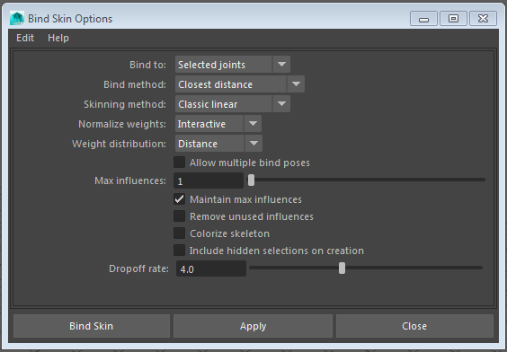

# dm2skin
A Python script for Maya that allows you to convert the results of a delta-mush deformer to standard skin weights.
 
You provide the tool with a skinned mesh (with one influence per vertex), a version of the mesh with the delta-mush deformer applied and a set of keyframed poses. For each vertex the script does some mathematical optimization in order to figure out the influence weights that will minimize the the total distance (summed over the poses provided) between the skinned vertex and its mushed partner. Effectively this makes the skinned model as "similar" as possible to the delta-mushed version.

It uses NumPy + SciPy to perform the minimization and should work on Maya 2016. Older Maya versions don't have the Delta-Mush deformer.

# Note

The script relies on Numpy and Scipy, but you have to use a specific version that is built to work with Maya's Python interpreter. This is included in the **dependencies** directory. I got these builds online from a guy who I forget the name of. I'll update this with his name and a link at some point.
 
# Installation

Clone the repository using the following command in Git Bash.

~~~
git clone https://github.com/duncanskertchly/dm2skin.git
~~~

Alternatively there is a little green button on the projects front page that will let you download it as a zipped file.

From the **dependencies** directory extract the two 7-Zip files to Mayas Python libraries directory. On Windows this is usually.

> C:\\Program Files\\Autodesk\\Maya2016\\Python\\Lib\\site-packages

So ultimately you should have these new directories.

> C:\\Program Files\\Autodesk\\Maya2016\\Python\\Lib\\site-packages\\numpy

> C:\\Program Files\\Autodesk\\Maya2016\\Python\\Lib\\site-packages\\scipy

From the root folder copy **dm2skin.py** to your Maya scripts folder. Usually this.

> C:\\Users\\\<User\>\\Documents\\maya\\2016\\scripts

Re-boot Maya and test the install using the little bit of code in step 3 of the **How To Use** section below.

# How To Use

1. Skin your mesh to its skeleton using skinning options similar to the ones below. It's important that initially you use only one influence per vertex.

	

2. Paint your skin weights so that each part of your mesh is deformed reasonably (despite only having one weight per vert). Obviously it'll look pretty terrible, but if you make it as tidy as you can the delta mushed version will look better later.
3. Open the dm2skin UI using the following code.

	~~~
	import dm2skin
	dm2skin.dm2skin()
	~~~
A GUI should appear that looks like this.

	

4. Select your newly skinned mesh and hit the **<<** button. Your mesh will be added to the **Source Mesh** field on the left.

5. Hit **Create Mush**. A new version of your mesh should be created called **\<YourMesh\>\_Mush**.

6. Keyframe a set of extreme poses making sure to leave the first frame on your timeline as the **bind pose**. I have found 4 / 5 poses works well. Theses poses should move and rotate the characters bones in to all the kinds of poses that your character will need to achieve. You need to provide plenty of information to the minimization algorithm to get decent results.

7. Select this mesh and tweak the **deltaMush** deformer to give the results you are after. You can use the **Toggle Mesh Visibility** and **Toggle Mush Visibility** buttons in the GUI to easily hide and show the two meshes. 

8. When you're happy set the **Max Influences** value which corresponds to the maximum number of influences that will be used for your skin cluster once the conversion has completed. In my experiments I've found 4 to be about the lowest you'll want to go to give decent results.

9. Hit **Transfer To Skin**.

10. Wait while the tool does its work. The conversion process will take longer the more verts that are present in the mesh. Increasing the **Max Influences** value will also increase the time the process takes. A 10k vert mesh using 5 influences takes around 2 minutes on my work PC.

11. Once the process finishes you can have a look at the result. If you're not happy just hit undo and the weights will go back to your previous rigid weights.

12. If you are happy hit **Delete Mush** and do any tweaks to the weights that you think are necessary.

# Getting Good Results

* I have found that the best way to improve the results of the skin transfer is to make adjustments to the keyframed poses you provide. Not the number (4 / 5 is usually fine), but the poses themselves. For instance if you find that the shoulder / upper arm vertices on your humanoid character don't deform nicely when you twist the upper arm, undo the transfer and go and put some twist in to the upper arms on a few of your poses and re-run the transfer. Remember it can only optimize the weights from the information you provide.

* On each pose try and move or rotate every bone. For instance if you've got finger bones that you leave stationary in all your poses the optimization algorithm may well conclude that it can just bind those vertices to the wrist joint. It doesn't know any better unless you tell it. Put lots of rotation on them to ensure the algorithm doesn't reach those kind of strange conclusions.
 
* I've noticed that the optimization process will sometimes put a very small amount of weight on joints that don't make too much sense. For instance you may find that the neck very slightly influences vertices around the chest area and that type of thing. It's just an artefact of the numerical optimization. In this instance I'd usually just use Maya's __Prune Small Weights__ tool until that influence disappears.

* The more influences you allow the better the result will be. Lower influence counts may require a bit more tweaking, but will usually be a very good starting point for your skinning.

# Example Files

There two Maya files in the **examples** folder which give you an idea of the before and after results. The **test_done.ma** file is a warts and all result of the tool, I've not done any tweaking to the skinning. Looking at the **test_start.ma** is a quite useful illustration of some of the points I've made in the previous section.

